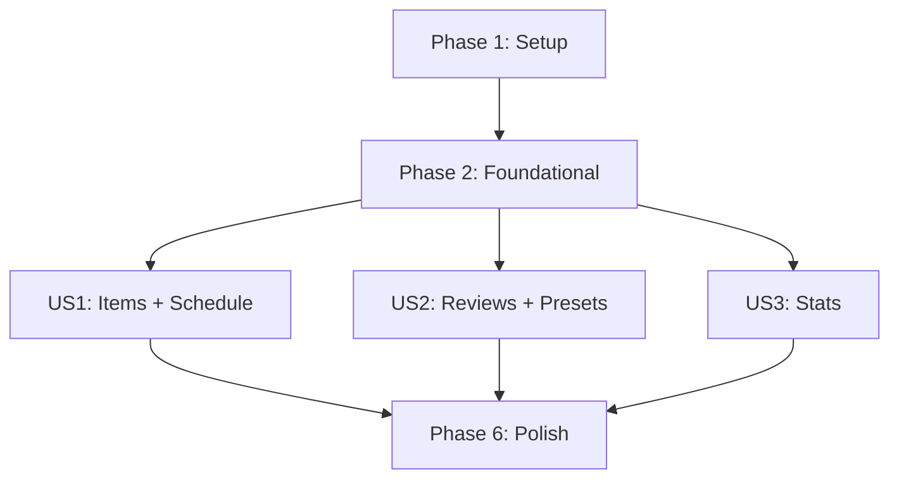

# Tasks: 忘却曲線管理（Forgetting Curve Manager）

**Input**: Design documents from `/specs/001-forgetting-curve-manager/`
**Prerequisites**: plan.md（必須）, spec.md（必須）, research.md, data-model.md, contracts/, quickstart.md

**Tests**: 本仕様ではTDD/テスト作成が明示されていないため、タスクは実装＋手動検証（quickstart）中心とする。

**Organization**: タスクはユーザーストーリーごと（[US1]〜）に整理し、各ストーリーが独立して実装・検証可能になるようにする。

## Format（厳守）

- [ ] T001 説明（必ずファイルパスを含める）
- [ ] T005 [P] 説明（並列実行可能）
- [ ] T012 [P] [US1] 説明（ユーザーストーリーに紐づく）

---

## Phase 1: Setup（Shared Infrastructure）

- [X] T001 リポジトリ直下に npm workspaces を設定する `package.json`
- [X] T002 [P] 共有パッケージの土台を作る `shared/package.json`, `shared/tsconfig.json`, `shared/src/index.ts`
- [X] T003 [P] Backend の土台を作る `backend/package.json`, `backend/tsconfig.json`, `backend/src/server.ts`, `backend/src/app.ts`
- [X] T004 [P] Frontend を Vite + React + TS で作る `frontend/package.json`, `frontend/vite.config.ts`, `frontend/src/main.tsx`, `frontend/src/app.tsx`
- [X] T005 [P] Tailwind をセットアップする `frontend/tailwind.config.ts`, `frontend/postcss.config.js`, `frontend/src/index.css`
- [X] T005a [P] フロントエンドのディレクトリ設計を反映する（pages/uniqueParts/uiParts/services/api/hooks/domain/types） `frontend/src/pages/`, `frontend/src/uniqueParts/`, `frontend/src/uiParts/`, `frontend/src/services/api/`, `frontend/src/hooks/`, `frontend/src/domain/types/`
- [X] T006 各パッケージから `shared` を参照できるようにする（依存関係/ビルド導線） `backend/package.json`, `frontend/package.json`, `shared/package.json`

---

## Phase 2: Foundational（Blocking Prerequisites）

- [X] T007 共有のエラー契約と日付ユーティリティを追加する `shared/src/contracts/error.ts`, `shared/src/lib/date.ts`, `shared/src/index.ts`
- [X] T008 Backend の環境変数ロードと設定を追加する `backend/src/config/env.ts`
- [X] T008a Backend の環境変数テンプレート（例）を追加し、手順に反映する `backend/.env.example`, `specs/001-forgetting-curve-manager/quickstart.md`
- [X] T009 Prisma + PostgreSQL の初期設定を行う `backend/prisma/schema.prisma`, `backend/src/db/prisma.ts`
- [X] T009a Prisma migrate/generate を実行してDBに反映する（手動検証） `specs/001-forgetting-curve-manager/quickstart.md`
- [X] T010 Prisma に最小スキーマを定義する（LearningItem/ReviewSchedule/ReviewEvent/ReviewPreset/Settings） `backend/prisma/schema.prisma`
- [X] T011 既定プリセットと Settings を投入する seed を用意する（任意でサンプル LearningItem / ReviewSchedule / ReviewEvent も投入できる） `backend/prisma/seed.ts`, `backend/src/config/env.ts`
- [X] T011a seed を実行して既定データをDBに投入する（手動検証） `specs/001-forgetting-curve-manager/quickstart.md`
- [X] T012 Backend の基盤ミドルウェアを実装する（CORS/JSON/ロギング/エラーハンドリング） `backend/src/app.ts`, `backend/src/lib/logger.ts`, `backend/src/api/middleware/errorHandler.ts`
- [X] T013 zod によるリクエスト検証ヘルパーを実装する `backend/src/api/middleware/validate.ts`
- [X] T014 API ルーティングの骨組みを作る `backend/src/api/router.ts`, `backend/src/api/routes/health.ts`
- [X] T015 Frontend のルーティングとプロバイダを用意する（router/react-query） `frontend/src/pages/routes.tsx`, `frontend/src/hooks/queryClient.ts`, `frontend/src/app.tsx`
- [X] T016 APIクライアント（axios）を共通化する（薄く） `frontend/src/services/api/http.ts`

**Checkpoint**: Backend/Frontend が起動でき、`shared` を参照でき、DBマイグレーション/seed が動かせる状態。

---

## Phase 3: User Story 1 - 学習項目を登録し、次の復習タイミングを把握する (Priority: P1) 🎯 MVP

**Goal**: 学習項目の登録と、次回復習予定日（dueOn）付き一覧表示を提供する。

**Independent Test**: 学習項目を1件登録し、直後に一覧に表示され、次回復習予定日が確認できる。

- [X] T017 [P] [US1] 学習項目のAPI契約（zod）を定義する `shared/src/contracts/items.ts`, `shared/src/index.ts`
- [X] T018 [P] [US1] スケジュール計算ユーティリティを実装する（dueOn = today + intervalsDays[stage]） `backend/src/services/scheduler/calcDueOn.ts`
- [X] T019 [US1] 学習項目作成時に ReviewSchedule を初期化するサービスを実装する `backend/src/services/items/itemsService.ts`
- [X] T020 [US1] POST `/api/items` を実装する `backend/src/api/routes/items.ts`
- [X] T021 [US1] GET `/api/items`（dueOn昇順）を実装する `backend/src/api/routes/items.ts`
- [X] T022 [US1] GET `/api/items/:id` を実装する（item + schedule + recentEvents） `backend/src/api/routes/items.ts`
- [X] T023 [US1] PATCH `/api/items/:id` を実装する `backend/src/api/routes/items.ts`
- [X] T024 [US1] DELETE `/api/items/:id` を実装する（関連 schedule/events の扱いも決めて実装） `backend/src/api/routes/items.ts`
- [X] T025 [P] [US1] 学習項目のフロントAPIクライアントを作る `frontend/src/services/api/items.ts`
- [X] T026 [US1] 一覧ページ（追加フォーム＋一覧）を実装する（スマホ/タブレット/PCで操作できるようレスポンシブ対応） `frontend/src/pages/ItemsPage.tsx`, `frontend/src/uniqueParts/items/ItemForm.tsx`, `frontend/src/uniqueParts/items/ItemsTable.tsx`
- [X] T027 [US1] 期限切れ（dueOn < today）を識別表示する（レスポンシブ表示を崩さない） `frontend/src/pages/ItemsPage.tsx`, `frontend/src/uniqueParts/items/ItemsTable.tsx`
- [X] T028 [US1] ルーティングに一覧ページを登録する `frontend/src/pages/routes.tsx`

**Checkpoint**: US1 のみで価値が成立（登録→一覧→予定日可視化）。

---

## Phase 4: User Story 2 - 復習を実行し、結果を記録して復習計画を更新する (Priority: P2)

**Goal**: 復習結果（success/failure）を記録し、次回予定日を更新できるようにする。

**Independent Test**: 1件の学習項目に対して復習結果を登録し、次回復習予定日が更新されることを確認できる。

- [X] T029 [P] [US2] 復習/プリセットのAPI契約（zod）を定義する `shared/src/contracts/reviews.ts`, `shared/src/contracts/presets.ts`, `shared/src/index.ts`
- [X] T030 [US2] 復習記録とスケジュール更新のドメインロジックを実装する（成功でstage+1、失敗でstage=0、クランプ、イベントに予定日/ステージをスナップショット） `backend/src/services/reviews/reviewService.ts`
- [X] T031 [US2] POST `/api/items/:id/reviews` を実装する `backend/src/api/routes/reviews.ts`
- [X] T032 [US2] items ルートに reviews ルートを組み込む `backend/src/api/routes/items.ts`, `backend/src/api/router.ts`
- [X] T033 [US2] プリセット一覧/アクティブ取得を実装する GET `/api/presets` `backend/src/api/routes/presets.ts`
- [X] T034 [US2] プリセット編集を実装する PATCH `/api/presets/:id` `backend/src/api/routes/presets.ts`
- [X] T035 [US2] アクティブプリセット切替を実装する PUT `/api/presets/active` `backend/src/api/routes/presets.ts`
- [X] T036 [P] [US2] 復習/プリセットのフロントAPIクライアントを作る `frontend/src/services/api/reviews.ts`, `frontend/src/services/api/presets.ts`
- [X] T037 [US2] 復習ページを実装する（対象条件はURLクエリで保持、success/failure 必須、difficulty/memo 任意、レスポンシブ対応） `frontend/src/pages/ReviewPage.tsx`, `frontend/src/uniqueParts/review/ReviewForm.tsx`
- [X] T038 [US2] プリセット編集ページを実装する（intervalsDays配列編集＋active切替、レスポンシブ対応） `frontend/src/pages/PresetsPage.tsx`, `frontend/src/uniqueParts/presets/PresetEditor.tsx`
- [X] T039 [US2] ルーティングに復習/プリセットページを登録する `frontend/src/pages/routes.tsx`

**Checkpoint**: US2 のみで「復習→記録→次回予定更新」が成立。

---

## Phase 5: User Story 3 - 学習状況を振り返り、継続のための指標を確認する (Priority: P3)

**Goal**: 指定期間の集計（期限内実施率、遅延数、成功率）を表示する。

**Independent Test**: 複数の復習履歴を作成し、直近7日等の期間で集計値が確認できる。

- [X] T040 [P] [US3] 集計API契約（zod）を定義する `shared/src/contracts/stats.ts`, `shared/src/index.ts`
- [X] T041 [US3] 集計ロジックを実装する（期限内=reviewedOn == scheduledDueOn、遅延=reviewedOn > scheduledDueOn） `backend/src/services/stats/statsService.ts`
- [X] T042 [US3] GET `/api/stats?from&to` を実装する `backend/src/api/routes/stats.ts`
- [X] T043 [US3] router に stats ルートを登録する `backend/src/api/router.ts`
- [X] T044 [P] [US3] 集計のフロントAPIクライアントを作る `frontend/src/services/api/stats.ts`
- [X] T045 [US3] 集計ページを実装する（期間はURLクエリで保持、少なくとも直近7日プリセットを提供、レスポンシブ対応） `frontend/src/pages/StatsPage.tsx`, `frontend/src/uniqueParts/stats/StatsRangePicker.tsx`
- [X] T046 [US3] ルーティングに集計ページを登録する `frontend/src/pages/routes.tsx`

**Checkpoint**: US3 のみで「期間指定→集計表示」が成立。

---

## Phase 6: Polish & Cross-Cutting Concerns

- [X] T047 [P] quickstart の手順で実際に起動確認し、必要なら手順を更新する（主要画面をスマホ/タブレット/PC幅で目視確認） `specs/001-forgetting-curve-manager/quickstart.md`
- [X] T048 APIエラーの表示を各ページで最小限整備する（失敗時にユーザーが原因を把握できる） `frontend/src/pages/ItemsPage.tsx`, `frontend/src/pages/ReviewPage.tsx`, `frontend/src/pages/PresetsPage.tsx`, `frontend/src/pages/StatsPage.tsx`

（注）汎用UIは既存前提のため、追加実装が必要な場合は `frontend/src/uiParts/` 配下に作成する。

---

## Dependencies & Execution Order

### User Story completion order

- Setup（Phase 1） → Foundational（Phase 2） → US1（Phase 3） → US2（Phase 4） → US3（Phase 5） → Polish（Phase 6）

### Dependency graph

### Why this order

- US1 がMVP（予定の可視化）で最優先。
- US2 は予定更新の価値を追加し、プリセット編集（FR-008）もここで満たす。
- US3 は履歴が前提なので最後。

---

## Parallel Execution Examples

### US1

- [P] タスク例: T017（shared契約）と T018（backendスケジュール計算）は別ファイルなので並列可。
- [P] タスク例: T025（frontend API client）と T020/T021（backend items routes）は並列可（契約が固まっている前提）。

### US2

- [P] タスク例: T029（shared契約）と T030（backendドメインロジック）は並列可。
- [P] タスク例: T036（frontend clients）と T033〜T035（backend presets routes）は並列可。

### US3

- [P] タスク例: T040（shared契約）と T041（backend集計ロジック）は並列可。
- [P] タスク例: T044（frontend client）と T042（backend stats route）は並列可。

---

## Implementation Strategy

### MVP First（US1のみ）

1. Phase 1 → Phase 2 を完了して基盤を起動可能にする
2. US1 を完了して「登録→一覧→予定日表示」を動作確認する
3. ここで一旦止めて、UX/計算ルール（dueOn）を確認する

### Incremental Delivery

- US1 → US2 → US3 の順に、常に「それだけで動く」状態を保つ。
